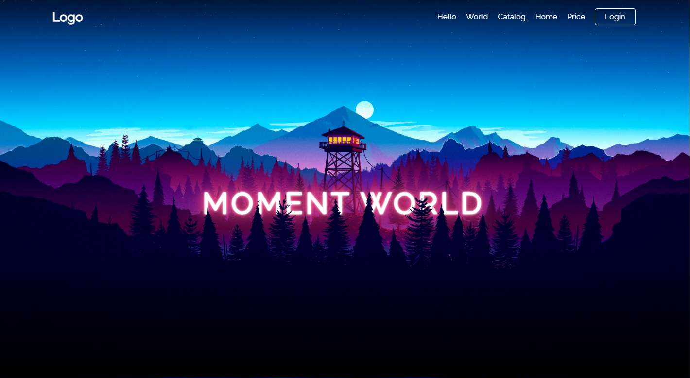

<h1 align="center">Bike Shop</h1>
<div align="center" id="top">

</div>
&#xa0;


<p align="center">
  

  

  

  

  
</p>


<p align="center">
  <a href="#dart-about">About</a> &#xa0; | &#xa0; 
  <a href="#sparkles-features">Features</a> &#xa0; | &#xa0;
  <a href="#rocket-technologies">Technologies</a> &#xa0; | &#xa0;
  <a href="#white_check_mark-requirements">Requirements</a> &#xa0; | &#xa0;
  <a href="#checkered_flag-starting">Starting</a> &#xa0; | &#xa0;
  <a href="#memo-license">License</a> &#xa0; | &#xa0;
  <a href="https://github.com/matmon12" target="_blank">Author</a>
</p>

<br>

## :dart: About

Online store selling bicycles. The layout was completed and functionality was created in js. Implemented bread crumbs, product card, star rating and more.

## :sparkles: Features

:heavy_check_mark: Search by product;\
:heavy_check_mark: Form Validation;\
:heavy_check_mark: Playing videos on the site;\
:heavy_check_mark: Slider with product photos;\
:heavy_check_mark: Tabs, star rating, breadcrumbs, filters, price range;\
:heavy_check_mark: Adaptive for mobile devices;

## :rocket: Technologies

The following tools were used in this project:

- [JustValidate](https://just-validate.dev/)
- [Video.js](https://videojs.com/)
- [Swiper.js](https://swiperjs.com/)
- [noUiSlider.js](https://refreshless.com/nouislider/)
- [Choices.js](https://choices-js.github.io/Choices/)

## :white_check_mark: Requirements

Before starting :checkered_flag:, you need to have [Git](https://git-scm.com) and [Node](https://nodejs.org/en/) installed.

## :checkered_flag: Starting

```bash
# Clone this project
$ git clone https://github.com/matmon12/Bike-Shop

# Access
$ cd Bike-Shop

# Install dependencies
$ npm install

# Run the project
$ gulp

# Compiles and minifies for production
$ gulp build
```

## :memo: License

This project is under license from MIT. For more details, see the [LICENSE](LICENSE) file.

Made with :heart: by <a href="https://github.com/matmon12" target="_blank">Matmon</a>

&#xa0;

<a href="#top">Back to top</a>
